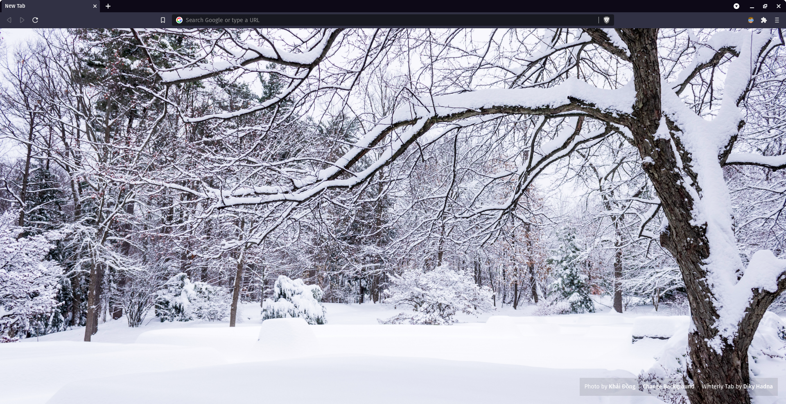
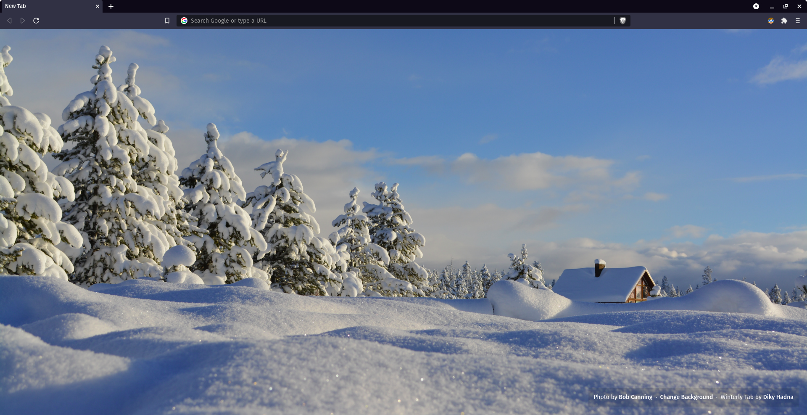
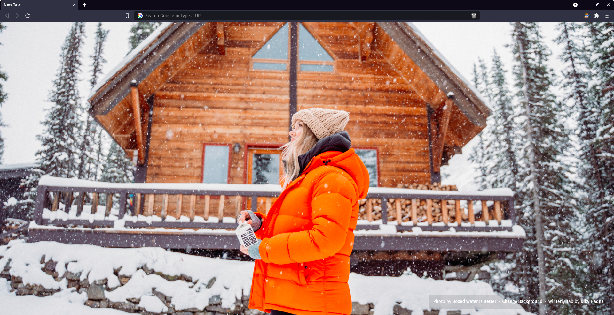
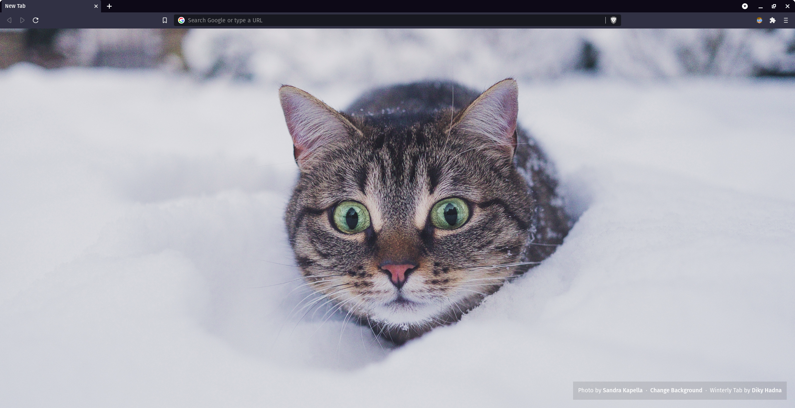
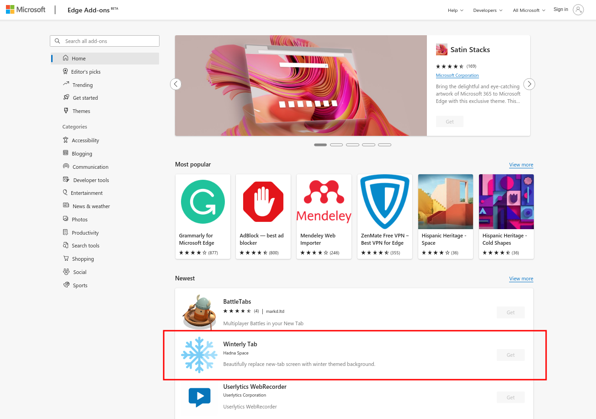

# ❄️ Winterly Tab ❄️
<!-- ALL-CONTRIBUTORS-BADGE:START - Do not remove or modify this section -->

<!-- ALL-CONTRIBUTORS-BADGE:END -->

Beautifully replace new tab screen with winter themed background. Image background automatically changed every 5 minutes, or you can change it manually.

Winterly Tab is made to be clean and minimalist new tab replacement for your browser. All images are taken from [Unsplash](https://unsplash.com/s/photos/winter?orientation=landscape).

Click to see more screenshots

---
## 🌏 Web Version

This project is available for you to visit in the web version. This web version will always contain the latest updates & features compared to the browser extension version since updating the browser extension need to be reviewed first by the add-ons or web store administrator, and it takes time.

To see the web version of this project, please visit [tab.winterly.app](https://tab.winterly.app).

---

## 🌟 Featured by Microsoft

Whoa! I still can believe this, but Winterly Tab is featured by Microsoft in their [Microsoft Edge Add-ons](https://microsoftedge.microsoft.com/addons/Microsoft-Edge-Extensions-Home) front page. This really means so much for this project. Thank you [@MSEdgeDev](https://twitter.com/MSEdgeDev) for making this happen. I really appreciate this! 😊

_This screenshot was taken at October 6, 2021_

---

## 📡 Installation

To install this extension, download from these channels:

| Web Browser | Download Link                                                                                                                                   |
| ----------- | ----------------------------------------------------------------------------------------------------------------------------------------------- |
| Edge        | [Download from Microsoft Edge Add-ons Website](https://microsoftedge.microsoft.com/addons/detail/winterly-tab/pbpanekbjohgcgfejhoelngbinagbclj) |
| Chrome      | [Download from Chrome Web Store](https://chrome.google.com/webstore/detail/winterly-tab/fcbaofhfpeakjobpnemojmibbnkpgigi)                       |
| Firefox     | [Download from Mozilla Add-ons for Firefox](https://addons.mozilla.org/en-US/firefox/addon/winterly-tab/)                                       |
| Safari      | _(not yet supported)_                                                                                                                           |

---

## 🔧 Development

This extension is made using `create-react-app`. To run this extension locally, do the following steps:

1. Fork this repository

2. Clone the forked repository using this command

`$ git clone https://github.com/<your_username>/winterly-tab.git`

3. Navigate to cloned directory

`$ cd winterly-tab`

4. Install all dependencies

`$ npm install`

5. Run the project

`$ npm start`

---

## 💡 Testing Locally

1. Build the project using this command

`$ npm run build`

2. Follow [this guide](https://support.google.com/chrome/a/answer/2714278?hl=en) to test the extension locally.

3. Be sure to use `build` directory in the project root directory when testing locally.

---

## 🎃 Contribution for Hacktoberfest 🎃

🎉 Thank you for your interest in contributing to this project 🎉

This project is open for contribution for 🎃 Hacktoberfest 2021 🎃

Before you start to contribute, I recommend you to read the [CONTRIBUTING.md](CONTRIBUTING.md).

---

## 🧑‍💻 Credits

This extension is brought to you by **Diky Hadna** ([@dkhd](https://github.com/dkhd)).

---

## 📝 License

The MIT License (MIT)

Copyright (c) 2021 Diky Hadna

Permission is hereby granted, free of charge, to any person obtaining a copy of this software and associated documentation files (the "Software"), to deal in the Software without restriction, including without limitation the rights to use, copy, modify, merge, publish, distribute, sublicense, and/or sell copies of the Software, and to permit persons to whom the Software is furnished to do so, subject to the following conditions:

The above copyright notice and this permission notice shall be included in all copies or substantial portions of the Software.

THE SOFTWARE IS PROVIDED "AS IS", WITHOUT WARRANTY OF ANY KIND, EXPRESS OR IMPLIED, INCLUDING BUT NOT LIMITED TO THE WARRANTIES OF MERCHANTABILITY, FITNESS FOR A PARTICULAR PURPOSE AND NONINFRINGEMENT. IN NO EVENT SHALL THE AUTHORS OR COPYRIGHT HOLDERS BE LIABLE FOR ANY CLAIM, DAMAGES OR OTHER LIABILITY, WHETHER IN AN ACTION OF CONTRACT, TORT OR OTHERWISE, ARISING FROM, OUT OF OR IN CONNECTION WITH THE SOFTWARE OR THE USE OR OTHER DEALINGS IN THE SOFTWARE.

## Contributors ✨

Thanks goes to these wonderful people ([emoji key](https://allcontributors.org/docs/en/emoji-key)):

<!-- ALL-CONTRIBUTORS-LIST:START - Do not remove or modify this section -->
<!-- prettier-ignore-start -->
<!-- markdownlint-disable -->
<table>
  <tr>
    <td align="center"><a href="https://sandernobel.dev"> <b>Sander Nobel</b></a> <a href="https://github.com/dkhd/winterly-tab/commits?author=sano2019" title="Code">💻</a> <a href="https://github.com/dkhd/winterly-tab/commits?author=sano2019" title="Documentation">📖</a></td>
    <td align="center"><a href="https://hadna.space"> <b>Diky Hadna</b></a> <a href="https://github.com/dkhd/winterly-tab/commits?author=dkhd" title="Code">💻</a> <a href="https://github.com/dkhd/winterly-tab/commits?author=dkhd" title="Documentation">📖</a> <a href="#design-dkhd" title="Design">🎨</a></td>
    <td align="center"><a href="http://je-poy.github.io"> <b>Jeff</b></a> <a href="https://github.com/dkhd/winterly-tab/commits?author=je-poy" title="Code">💻</a></td>
    <td align="center"><a href="https://boidushya.com"> <b>Boidushya</b></a> <a href="https://github.com/dkhd/winterly-tab/commits?author=boidushya" title="Code">💻</a></td>
    <td align="center"><a href="https://gladiusmusic.rf.gd"> <b>Ventus</b></a> <a href="#ideas-V3ntus" title="Ideas, Planning, & Feedback">🤔</a></td>
    <td align="center"><a href="https://berviantoleo.my.id"> <b>Bervianto Leo Pratama</b></a> <a href="https://github.com/dkhd/winterly-tab/commits?author=berviantoleo" title="Code">💻</a> <a href="https://github.com/dkhd/winterly-tab/commits?author=berviantoleo" title="Tests">⚠️</a></td>
    <td align="center"><a href="https://github.com/bigsbunny"> <b>Bighnesh Sahoo</b></a> <a href="#ideas-bigsbunny" title="Ideas, Planning, & Feedback">🤔</a></td>
  </tr>
  <tr>
    <td align="center"><a href="https://github.com/shukapurv"> <b>Apoorve shukla</b></a> <a href="#ideas-shukapurv" title="Ideas, Planning, & Feedback">🤔</a></td>
  </tr>
</table>

<!-- markdownlint-restore -->
<!-- prettier-ignore-end -->

<!-- ALL-CONTRIBUTORS-LIST:END -->

This project follows the [all-contributors](https://github.com/all-contributors/all-contributors) specification. Contributions of any kind welcome!
